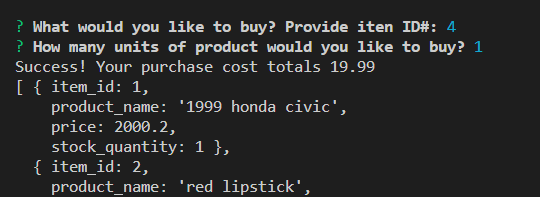
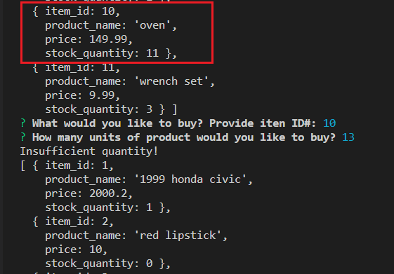

# Bamazon
## Node.js &amp; SQL storefront - customer view

## Instructions
1. In terminal, run `node bamazonCustomer.js` from directory.

2. Marketplace stock will show in terminal. You will be prompted to specify the Item ID# & Quantity that you would like to buy.

    * If item is in stock, you will receive a message notifying you that your purchase was successful and will reflect the total price of your purchase. You'll then be returned to the marketplace where you can make another purchase.

    

    

    * Otherwise, you will be notified that the quantity you requested is insufficent, and you'll be returned to the marketplace's prompt to purchase.

    
